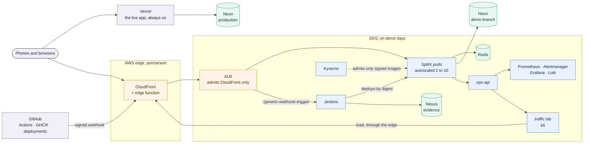
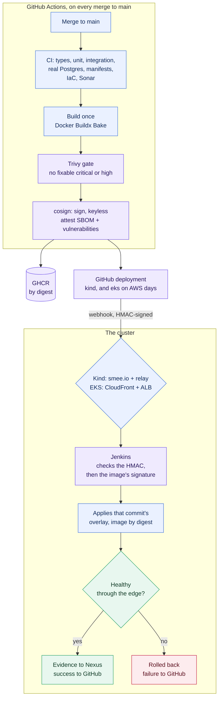
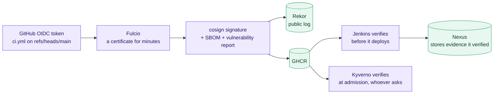
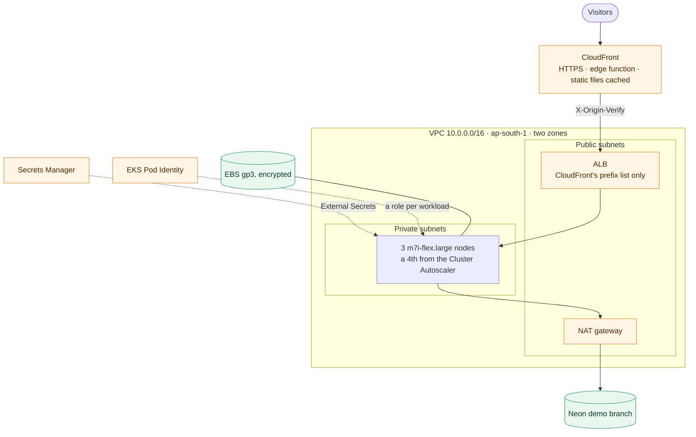
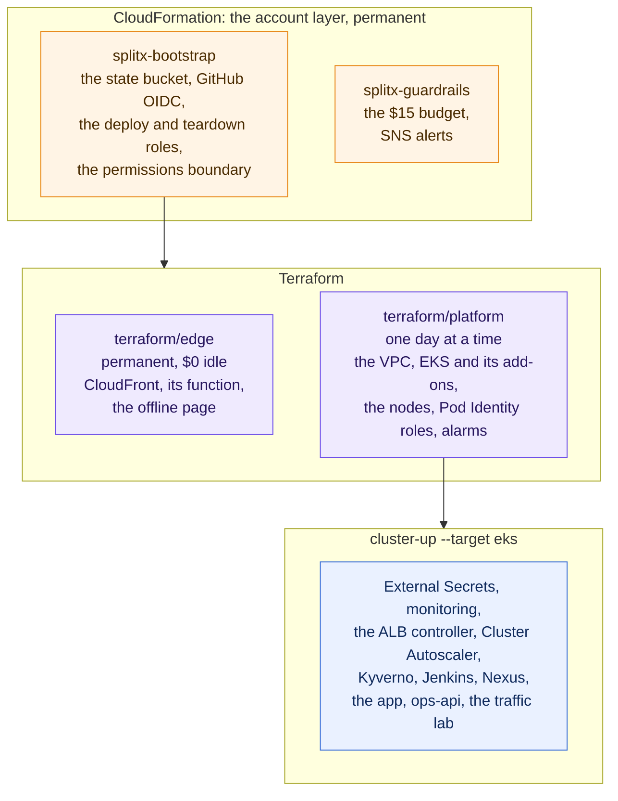
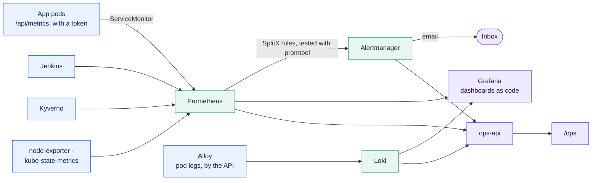
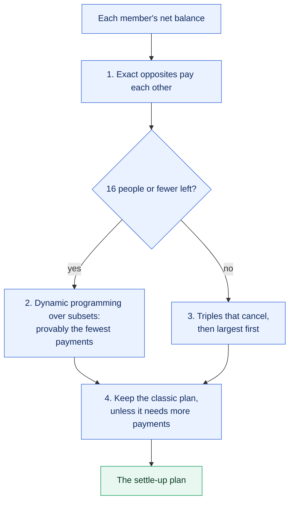

<div align="center">

# SplitX

**Split expenses with friends, on a platform where every DevOps tool does real, checkable work.**

[](https://github.com/Sayandip-Jana-1018/SplitX/actions/workflows/ci.yml)
[](https://github.com/Sayandip-Jana-1018/SplitX/actions/workflows/codeql.yml)
[](https://github.com/Sayandip-Jana-1018/SplitX/actions/workflows/kind-e2e.yml)
[](https://sonarcloud.io/summary/new_code?id=Sayandip-Jana-1018_SplitX)
[](https://splitsj.vercel.app)
[](#the-supply-chain)

[**The live app**](https://splitsj.vercel.app) · [**Every decision**](docs/DECISIONS.md) · [**The demo-day runbook**](docs/DEMO_DAY.md) · [**The evidence**](#the-evidence)

<br/>


<!--
  Space for the control room, from the rehearsal on AWS:
  
  
-->

</div>

---

## Contents

- [What SplitX is](#what-splitx-is)
- [The platform at a glance](#the-platform-at-a-glance)
- [From a merge to a running pod](#from-a-merge-to-a-running-pod)
- [The supply chain](#the-supply-chain)
- [On AWS](#on-aws)
- [Observability](#observability)
- [Every tool, and what proves it](#every-tool-and-what-proves-it)
- [The evidence](#the-evidence)
- [The app](#the-app)
- [Run it](#run-it)
- [Where things are](#where-things-are)

---

## What SplitX is

**An expense-splitting app**, installable on a phone. You record who paid for what in groups and
trips, and it settles everyone up in the fewest payments, with UPI links. It is built with Next.js 16,
Prisma on Neon Postgres, and NextAuth v5, and it is live on Vercel for real users.

**A DevOps platform around it**, built so that nothing in the pipeline only *says* it worked.
- **The release:** every merge to `main` is tested, built once, scanned, signed and attested.
- **The delivery:** GitHub's signed webhook reaches Jenkins, which verifies the webhook's signature
  and the image's before it deploys, and rolls back anything that doesn't come up.
- **Admission:** the cluster itself refuses any image our release workflow didn't sign.
- **The control room:** `/ops` shows every tool's verdict, read live from the tool itself.

**Where it runs:**
- **On GitHub's runners, every night:** the whole platform on Kind, driven end to end.
- **On AWS EKS, on demo days,** behind CloudFront. It is built that morning, and removed that evening.

Every decision, what was rejected, and the measurement behind each claim is in
**[docs/DECISIONS.md](docs/DECISIONS.md)**: 105 decisions, with the open problems at the end.

---

## The platform at a glance


```mermaid
flowchart LR
    phones(["Phones and browsers"])
    gh["GitHub<br/>Actions · GHCR · deployments"]
    vercel["Vercel<br/>the live app, always on"]
    neonProd[("Neon<br/>production")]

    subgraph edge["AWS edge, permanent"]
        cf["CloudFront<br/>+ edge function"]
    end

    subgraph eks["EKS, on demo days"]
        alb["ALB<br/>admits CloudFront only"]
        app["SplitX pods<br/>autoscaled 2 to 10"]
        redis[("Redis")]
        opsapi["ops-api"]
        lab["traffic lab<br/>k6"]
        jenkins["Jenkins"]
        nexus[("Nexus<br/>evidence")]
        mon["Prometheus · Alertmanager<br/>Grafana · Loki"]
        kyverno["Kyverno"]
    end
    neonDemo[("Neon<br/>demo branch")]

    phones --> vercel --> neonProd
    phones --> cf --> alb --> app
    app --> redis
    app --> neonDemo
    app --> opsapi --> mon
    opsapi --> lab -->|"load, through the edge"| cf
    gh -->|"signed webhook"| cf
    alb -->|"/generic-webhook-trigger/"| jenkins
    jenkins -->|"deploys by digest"| app
    jenkins --> nexus
    kyverno -.->|"admits only signed images"| app

    classDef aws fill:#fff4e5,stroke:#e8891b,color:#4a2b00
    classDef k8s fill:#eaf1ff,stroke:#3b6fd8,color:#0f2a5c
    classDef ext fill:#f1f0f7,stroke:#6f6a8c,color:#231f36
    classDef data fill:#e8f7ef,stroke:#1f9d63,color:#0b3a24
    class cf,alb aws
    class app,opsapi,lab,jenkins,mon,kyverno k8s
    class gh,vercel,phones ext
    class neonProd,neonDemo,redis,nexus data
```

The same manifests run on both clusters: one Kustomize base, with an overlay each for Kind and AWS
(D-093). Kind proves the platform every night on a GitHub runner; EKS serves the demo.

---

## From a merge to a running pod


```mermaid
flowchart TB
    subgraph actions["GitHub Actions, on every merge to main"]
        direction LR
        push["Merge to main"] --> ci["CI: types, unit, integration,<br/>real Postgres, manifests,<br/>IaC, Sonar"]
        ci --> build["Build once<br/>Docker Buildx Bake"]
        build --> scan["Trivy gate<br/>no fixable critical or high"]
        scan --> sign["cosign: sign, keyless<br/>attest SBOM + vulnerabilities"]
    end
    sign --> ghcr[("GHCR<br/>by digest")]
    sign --> dep["GitHub deployment<br/>kind, and eks on AWS days"]
    subgraph cluster["The cluster"]
        direction LR
        way{"Kind: smee.io + relay<br/>EKS: CloudFront + ALB"} --> jen["Jenkins<br/>checks the HMAC,<br/>then the image's signature"]
        jen --> apply["Applies that commit's<br/>overlay, image by digest"]
        apply --> ok{"Healthy<br/>through the edge?"}
        ok -->|yes| done["Evidence to Nexus<br/>success to GitHub"]
        ok -->|no| back["Rolled back<br/>failure to GitHub"]
    end
    dep -->|"webhook, HMAC-signed"| way

    classDef step fill:#eaf1ff,stroke:#3b6fd8,color:#0f2a5c
    classDef trust fill:#efeafe,stroke:#6d4ee8,color:#27165e
    classDef good fill:#e8f7ef,stroke:#1f9d63,color:#0b3a24
    classDef bad fill:#fdecee,stroke:#c2183a,color:#5c0a1b
    class push,ci,build,apply,way step
    class scan,sign,ghcr,dep,jen trust
    class done,ok good
    class back bad
```

- **Proven with a real release:** a delivery through GitHub's own webhook takes about a minute on Kind
  (63 s in run 8).
- **Proven with a broken one:** a release that never becomes ready is rolled back while every request
  keeps getting 200. That was 617 of 617 in run 6, and 634 of 634 in run 5.

The details are in [D-054](docs/DECISIONS.md) and [D-055](docs/DECISIONS.md), the runs in
[D-099](docs/DECISIONS.md).

---

## The supply chain


```mermaid
flowchart LR
    oidc["GitHub OIDC token<br/>ci.yml on refs/heads/main"] --> fulcio["Fulcio<br/>a certificate for minutes"]
    fulcio --> sig["cosign signature<br/>+ SBOM + vulnerability report"]
    sig --> rekor[("Rekor<br/>public log")]
    sig --> ghcr[("GHCR")]
    ghcr --> jenkins["Jenkins verifies<br/>before it deploys"]
    ghcr --> kyverno["Kyverno verifies<br/>at admission, whoever asks"]
    jenkins --> nexus[("Nexus<br/>stores evidence it verified")]

    classDef trust fill:#efeafe,stroke:#6d4ee8,color:#27165e
    classDef store fill:#e8f7ef,stroke:#1f9d63,color:#0b3a24
    class oidc,fulcio,sig,jenkins,kyverno trust
    class rekor,ghcr,nexus store
```

There is no signing key to leak. The certificate names the workflow, the branch and the commit. The
cluster checks *whose* signature it is, not only that one exists: the same image, judged against
another workflow, is refused ([D-060](docs/DECISIONS.md)). Anyone can check a release:

```bash
cosign verify ghcr.io/sayandip-jana-1018/splitx:<first 12 characters of a commit on main> \
  --certificate-identity https://github.com/Sayandip-Jana-1018/SplitX/.github/workflows/ci.yml@refs/heads/main \
  --certificate-oidc-issuer https://token.actions.githubusercontent.com
```

---

## On AWS


```mermaid
flowchart TB
    user(["Visitors"]) --> cf["CloudFront<br/>HTTPS · edge function · static files cached"]
    subgraph vpc["VPC 10.0.0.0/16 · ap-south-1 · two zones"]
        subgraph pub["Public subnets"]
            alb["ALB<br/>CloudFront's prefix list only"]
            nat["NAT gateway"]
        end
        subgraph priv["Private subnets"]
            nodes["3 m7i-flex.large nodes<br/>a 4th from the Cluster Autoscaler"]
        end
    end
    cf -->|"X-Origin-Verify"| alb --> nodes
    nodes --> nat --> neon[("Neon demo branch")]
    sm["Secrets Manager"] -.->|"External Secrets"| nodes
    pod["EKS Pod Identity"] -.->|"a role per workload"| nodes
    ebs[("EBS gp3, encrypted")] --- nodes

    classDef aws fill:#fff4e5,stroke:#e8891b,color:#4a2b00
    classDef data fill:#e8f7ef,stroke:#1f9d63,color:#0b3a24
    class cf,alb,nat,sm,pod aws
    class neon,ebs data
```

**Who makes what:**


```mermaid
flowchart TB
    subgraph cfn["CloudFormation: the account layer, permanent"]
        boot["splitx-bootstrap<br/>the state bucket, GitHub OIDC,<br/>the deploy and teardown roles,<br/>the permissions boundary"]
        guard["splitx-guardrails<br/>the $15 budget,<br/>SNS alerts"]
    end
    subgraph tf["Terraform"]
        edge["terraform/edge<br/>permanent, $0 idle<br/>CloudFront, its function,<br/>the offline page"]
        plat["terraform/platform<br/>one day at a time<br/>the VPC, EKS and its add-ons,<br/>the nodes, Pod Identity roles, alarms"]
    end
    subgraph up["cluster-up --target eks"]
        sw["External Secrets, monitoring,<br/>the ALB controller, Cluster Autoscaler,<br/>Kyverno, Jenkins, Nexus,<br/>the app, ops-api, the traffic lab"]
    end
    boot --> tf
    plat --> up

    classDef cfn fill:#fff4e5,stroke:#e8891b,color:#4a2b00
    classDef tf fill:#efeafe,stroke:#6d4ee8,color:#27165e
    classDef k8s fill:#eaf1ff,stroke:#3b6fd8,color:#0f2a5c
    class boot,guard cfn
    class edge,plat tf
    class sw k8s
```

- **CloudFormation makes what Terraform needs before it can run:** the state bucket and the roles.
- **Terraform makes the rest.** Only a reviewed GitHub environment may build, and a separate role can
  only remove.
- **No workflow holds an AWS key.** Every role carries a permissions boundary.
- **The platform lives for a day.** `aws-up` builds and verifies it, `aws-down` proves nothing is
  left, and a scheduled `aws-down` at 23:30 IST catches a forgotten one
  ([D-087 to D-095](docs/DECISIONS.md)).

The setup is in [AWS_SETUP_GUIDE.md](AWS_SETUP_GUIDE.md), and each AWS day in
[docs/DEMO_DAY.md](docs/DEMO_DAY.md).

---

## Observability


```mermaid
flowchart LR
    app["App pods<br/>/api/metrics, with a token"] -->|"ServiceMonitor"| prom["Prometheus"]
    jen["Jenkins"] --> prom
    kyv["Kyverno"] --> prom
    ks["node-exporter ·<br/>kube-state-metrics"] --> prom
    prom -->|"SplitX rules, tested with promtool"| am["Alertmanager"] -->|"email"| inbox(["Inbox"])
    alloy["Alloy<br/>pod logs, by the API"] --> loki["Loki"]
    prom --> graf["Grafana<br/>dashboards as code"]
    loki --> graf
    prom --> opsapi["ops-api"]
    loki --> opsapi
    am --> opsapi
    opsapi --> page["/ops"]

    classDef src fill:#eaf1ff,stroke:#3b6fd8,color:#0f2a5c
    classDef store fill:#e8f7ef,stroke:#1f9d63,color:#0b3a24
    classDef out fill:#efeafe,stroke:#6d4ee8,color:#27165e
    class app,jen,kyv,ks,alloy src
    class prom,loki,am store
    class graf,opsapi,page,inbox out
```

- **Request IDs:** one request ID follows a request from the ingress to the pod's log line.
- **Alerts:** every SplitX alert is unit-tested to fire when it should, and to stay silent through load
  shedding, restarts and quiet nights.
- **The first real outage:** Redis was stopped on purpose, the alert email arrived 199 s later, and
  the resolution five minutes after the fix ([D-052](docs/DECISIONS.md)).

---

## Every tool, and what proves it

| Tool | What it does here | Where | What proves it |
|---|---|---|---|
| **Git, husky, commitlint, gitleaks** | Conventional commits. No secret reaches a commit, or the history. | `.husky/`, `commitlint.config.js` | Every commit in this repository |
| **GitHub Actions** | CI, the release, the Kind end-to-end run, and AWS up, verify and down | `.github/workflows/` | The badges above |
| **GitHub Deployments and webhooks** | Each release is announced as a deployment. The deployer reports back on it. | `ci.yml`, `jenkins/deploy.mjs` | `cd:verify`: GitHub's own delivery started the build |
| **CodeQL, Dependabot** | Code scanning, and vulnerable dependencies | `codeql.yml`, `.github/dependabot.yml` | The Security tab; counted on `/ops` |
| **SonarQube Cloud** | The quality gate on new code: coverage, ratings, duplication | `sonar-project.properties`, CI's `sonar` job | The gate badge above |
| **Vitest** | Unit, property, integration (Redis) and database (Postgres) tests | `tests/` | CI's `verify`, `integration` and `database` jobs |
| **Docker, Buildx Bake, Compose** | One image per release, built once, with no npm in it at run time. Compose runs local development. | `Dockerfile`, `docker-bake.hcl`, `docker-compose.yml` | 81 MB against a naive 1,091 MB; 0 vulnerabilities against 4,139 ([evidence](docs/evidence/image-comparison.md)) |
| **Trivy** | Gates each release on fixable critical and high vulnerabilities, and scans the IaC | CI's `release` and `iac` jobs | A release with such a finding is never signed |
| **cosign and Sigstore** | Keyless signatures and attestations | CI's `release` job | [`cosign verify`](#the-supply-chain), as above |
| **GHCR** | The registry, holding images by digest | `ghcr.io/sayandip-jana-1018/splitx` | The digest on `/ops` |
| **Jenkins** | The deployer: a webhook gate, signature checks, rollback, all as code | `helm/platform/jenkins.values.yaml`, `jenkins/` | `cd:verify`: 16 checks, including a release rolled back |
| **Nexus** | Each deployment's evidence, verified before it is stored | `nexus/` | `ops-verify`: the evidence is complete |
| **smee.io relay** | Carries GitHub's webhook to a cluster GitHub can't reach (Kind) | `jenkins/relay/` | `cd:verify`: a signed delivery arrives intact |
| **Kubernetes: Kind and EKS** | The same platform on both | `k8s/`, `k8s/kind/`, `terraform/platform` | `k8s:verify`: 37 live checks on Kind, and a target for EKS |
| **Kustomize, Helm** | One base with an overlay per cluster; third-party charts pinned | `k8s/overlays/`, `helm/platform/charts.json` | CI renders every overlay against the Kubernetes 1.35 schemas |
| **HPA, metrics-server, Cluster Autoscaler** | Pods from 2 to 10 on CPU, and a fourth node on EKS | `k8s/base/hpa.yaml` | The traffic lab: 2 to 10 pods in every Kind run |
| **ingress-nginx, AWS Load Balancer Controller** | The way in on Kind, and on EKS | `helm/platform/` | No request lost while every pod was replaced (2,391 of 2,391 in run 8) |
| **Kyverno, Pod Security, NetworkPolicies** | Refuse unsigned images, privileged pods, and cross-namespace traffic | `policy/`, `k8s/base/networkpolicy.yaml` | `k8s:verify` and `cd:verify`: each refusal tested live |
| **External Secrets Operator** | Kubernetes Secrets from AWS Secrets Manager, on EKS | `k8s/eks/secrets/` | `k8s:verify --target eks` |
| **Prometheus, Alertmanager, Grafana** | Metrics, alerts by email, dashboards as code | `monitoring/`, `k8s/base/prometheusrule.yaml` | `npm run test:alerts`; `k8s:verify`: every dashboard query runs |
| **Loki, Grafana Alloy** | Logs, searchable by request ID | `helm/platform/loki.values.yaml`, `alloy.values.yaml` | `k8s:verify` follows one request into the logs |
| **k6** | The traffic lab, and the load tests | `ops/lab/`, `scripts/load-run.mjs` | [Load tests](docs/evidence/load-tests.md); `ops-verify` |
| **CloudFormation** | The account layer: the state bucket, OIDC, the bounded roles, the budget | `cloudformation/` | cfn-lint and Trivy in CI; both stacks deployed |
| **Terraform** | The edge and the platform | `terraform/edge`, `terraform/platform` | `validate`, `tflint` and Trivy in CI |
| **AWS services** | VPC, EKS, EBS, ALB, CloudFront with a Function, S3, CloudWatch, Secrets Manager, IAM with OIDC and a boundary, Pod Identity, Budgets, SNS | `terraform/`, `cloudformation/` | `aws-up` checks each as it builds; `aws-verify` |

---

## The evidence

| What | Where |
|---|---|
| **The whole platform, end to end, nightly.** Kind on a GitHub runner, a delivery through GitHub's own webhook, then every verifier: `k8s:verify`, `cd:verify --rollback` and `ops-verify`. | The newest [Kind end-to-end run](https://github.com/Sayandip-Jana-1018/SplitX/actions/workflows/kind-e2e.yml): its summary has every result table, and its artifact keeps the reports. Runs 1 to 8 are in [D-099](docs/DECISIONS.md). The four reports below are run 8's, from 25 September 2026. |
| **The cluster:** probes against a real database outage, a release under traffic, network policy, monitoring end to end | [docs/evidence/kubernetes.md](docs/evidence/kubernetes.md) |
| **Delivery:** the webhook gate, the deploy account, admission, and a rollback | [docs/evidence/delivery.md](docs/evidence/delivery.md) |
| **The control room:** `/ops` as an operator reads it, from ops-api and the traffic lab | [docs/evidence/ops.md](docs/evidence/ops.md) |
| **The run itself:** the runner's memory throughout, each pod's use, and Jenkins' two consoles (the release, then the rollback) | [docs/evidence/kind-e2e/](docs/evidence/kind-e2e/) |
| **Load:** a classroom under production limits, overload on two pods, the autoscaler | [docs/evidence/load-tests.md](docs/evidence/load-tests.md) |
| **The image** against a naive build | [docs/evidence/image-comparison.md](docs/evidence/image-comparison.md) |
| **The ledger:** production's balances audited read-only | [docs/evidence/ledger-audit.json](docs/evidence/ledger-audit.json), [D-069](docs/DECISIONS.md) |
| **EKS** | The `eks-verify` artifact of each AWS day's `aws-up` run. The first is the rehearsal. |

---

## The app

- **Groups and trips:** expenses split equally, by percentage, by custom amounts, or item by item from
  a scanned receipt.
- **Settle up:** the fewest payments, with UPI links, and a per-group Balance Journey that explains
  every change.
- **AI, optional:** a Gemini chat assistant that answers from the ledger, and voice entry of expenses.
- **Receipts:** on-device OCR (Tesseract), or OpenAI Vision for itemised receipts. They are stored in
  Supabase Storage, uploaded with signed URLs.
- **Accounts:** email and password, Google, or GitHub. Rate limits are per device, under a
  ceiling per network, so a classroom behind one address isn't refused as one person
  ([D-045](docs/DECISIONS.md), [D-076](docs/DECISIONS.md)).
- **Everywhere:** installable as a PWA, twelve colour themes, light and dark, built for phones first.
- **`/scale`:** the public demo page. Plan a trip for up to 2,000 people, and see which pod answered.

### The settlement engine


```mermaid
flowchart TB
    bal["Each member's net balance"] --> opp["1. Exact opposites pay each other"]
    opp --> small{"16 people or fewer left?"}
    small -->|yes| dp["2. Dynamic programming over subsets:<br/>provably the fewest payments"]
    small -->|no| trip["3. Triples that cancel,<br/>then largest first"]
    dp --> keep["4. Keep the classic plan,<br/>unless it needs more payments"]
    trip --> keep
    keep --> plan["The settle-up plan"]

    classDef step fill:#eaf1ff,stroke:#3b6fd8,color:#0f2a5c
    classDef out fill:#e8f7ef,stroke:#1f9d63,color:#0b3a24
    class bal,opp,small,dp,trip,keep step
    class plan out
```

A group of *k* people whose balances add up to zero settles in *k − 1* payments, so the fewest
payments means the most such sets. A simulated 2,000-person event needs 1,818 payments instead of
1,999; repaying each expense directly would take 23,602 ([D-023](docs/DECISIONS.md)).

---

## Run it

**The app, locally** (Node 24):
```bash
npm ci
```
```bash
cp .env.example .env
```
Then fill in `.env`, and start Postgres and Redis with `docker compose up -d postgres redis`.
```bash
npm run dev
```

**Tests:**
- `npm test`: unit and property tests, 1,373 of them.
- `npm run test:integration`: against a real Redis.
- `npm run test:db`: against a real Postgres.
- `npm run test:alerts`: the alert rules, with promtool.

**Kubernetes: the platform on Kind.**
- `npm run k8s:up` builds the cluster. Then `npm run k8s:verify`, and
  `npm run cd:verify -- --rollback`.
- It needs about 8 GB of memory ([D-099](docs/DECISIONS.md)), so it runs every night on GitHub's
  runners: Actions → **Kind end-to-end**.

**On AWS:** set it up once with [AWS_SETUP_GUIDE.md](AWS_SETUP_GUIDE.md), then follow
[docs/DEMO_DAY.md](docs/DEMO_DAY.md) on each AWS day.

---

## Where things are

| Path | What |
|---|---|
| `src/` | The app: pages, API routes, and `src/lib` (the settlement planner, rate limiting, `/ops`) |
| `ops/` | ops-api and the traffic lab, the cluster half of `/ops` |
| `k8s/`, `helm/platform/`, `policy/`, `monitoring/` | The platform: manifests, pinned charts, admission policy, dashboards and alerts |
| `jenkins/`, `nexus/` | Delivery: Jenkins' job, its permissions and relay; Nexus and its setup |
| `terraform/`, `cloudformation/` | AWS: the edge, the platform, the account layer |
| `scripts/` | `cluster-up`, the verifiers, the load and AWS helpers |
| `docs/` | [DECISIONS](docs/DECISIONS.md), the [runbook](docs/DEMO_DAY.md), the [evidence](docs/evidence/) |

This project is private and not open-source.
