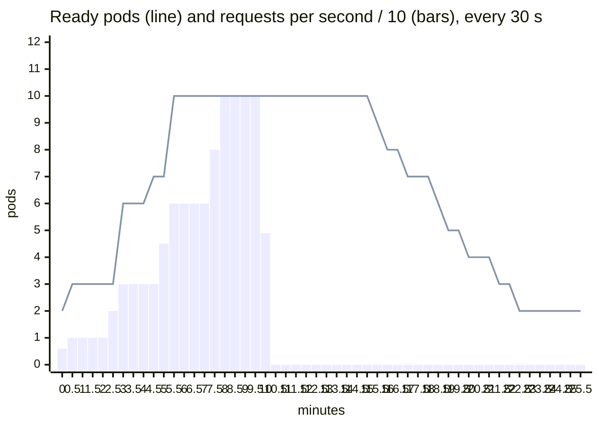

# Load tests: what real traffic did to the cluster

Generated by `scripts/load-report.mjs` from the raw results in [`docs/evidence/load/`](load/).
Every run: k6 2.2.0 in its official container on the same machine as the Kind cluster,
through ingress-nginx, from a single network address. Cluster state was sampled every
5 s, and can lead the request timeline by the 1 to 3 s k6 takes to start.

## Classroom: 80 devices behind one address, production limits

Students arrive over 30 seconds and plan a trip every 4 to 8 seconds; one extra
device plans as fast as it can. All of it comes from one network address, the way
a class on campus Wi-Fi reaches the internet through one NAT. ([load/classroom.js](../../load/classroom.js))

| Run | Build | Student plans served | Students refused (429) | Greedy device served | Greedy refused (429) | Student p95 |
|---|---|---|---|---|---|---|
| [before](load/classroom-before.json) | `f4b2dc209824` | 129 of 1,907 | 1,777 (93.2%) | 66 of 623 | 557 (89.4%) | 25 ms |
| [after](load/classroom-after.json) | `77178161f36c` | 1,912 of 1,912 | 0 (0%) | 168 of 617 | 449 (72.8%) | 28 ms |

## Saturation: more work than two pods can do

The deployment is pinned at two pods and sent 2,000-person plans faster than two cores
can compute them, with rate limits lifted. What matters is what happens to the requests
that are served once the backlog builds, and whether the pods survive it.
Runs are listed in the order they were made: the fixes of D-046, then the B-024
runs of D-053, which compare fresh pods with warm ones and a 1-CPU limit with none.
([load/saturation.js](../../load/saturation.js))

| Run | Build | Pods at the start | CPU limit | Served | Refused (503) | 502 / 504 | Restarts | Served p50 / p95 | Liveness checks answered |
|---|---|---|---|---|---|---|---|---|---|
| [before](load/saturation-before.json) | `f4b2dc209824` | - | - | 3,065 | 2,223 | 50 / 1,264 | 2 | 2475 ms / 26082 ms | not measured |
| [after-clock](load/saturation-after-clock.json) | `77178161f36c` | - | - | 2,984 | 4,190 | 26 / 0 | 1 | 1337 ms / 1888 ms | not measured |
| [after-probes](load/saturation-after-probes.json) | `77178161f36c` | - | - | 3,145 | 4,005 | 51 / 0 | 0 | 1320 ms / 1915 ms | 222 of 238, p95 9201 ms |
| [after-front-door](load/saturation-after-front-door.json) | `39cc320452d1` | - | - | 3,434 | 3,705 | 54 / 0 | 0 | 1329 ms / 1883 ms | 227 of 241, p95 6288 ms |
| [after-keepalive](load/saturation-after-keepalive.json) | `39cc320452d1` | - | - | 3,355 | 3,846 | 0 / 0 | 0 | 1379 ms / 1908 ms | 234 of 240, p95 1034 ms |
| [after-admission](load/saturation-after-admission.json) | `570fcf134d20` | - | - | 3,506 | 3,695 | 0 / 0 | 0 | 952 ms / 1212 ms | 241 of 241, p95 2403 ms |
| [monitored](load/saturation-monitored.json) | `570fcf134d20` | fresh, 16-18 s old | 1 | 3,574 | 3,627 | 0 / 0 | 0 | 913 ms / 1186 ms | 234 of 240, p95 914 ms |
| [cold](load/saturation-cold.json) | `570fcf134d20` | fresh, 19-22 s old | 1 | 3,618 | 3,582 | 0 / 0 | 0 | 927 ms / 1177 ms | 239 of 241, p95 938 ms |
| [warm](load/saturation-warm.json) | `570fcf134d20` | warm, 189-192 s old | 1 | 3,908 | 3,293 | 0 / 0 | 0 | 892 ms / 1157 ms | 241 of 241, p95 800 ms |
| [cold-warmed](load/saturation-cold-warmed.json) | `570fcf134d20` | fresh, 22-25 s old | 1 | 3,446 | 3,755 | 0 / 0 | 0 | 948 ms / 1211 ms | 237 of 240, p95 868 ms |
| [cold-2](load/saturation-cold-2.json) | `570fcf134d20` | fresh, 21-24 s old | 1 | 3,400 | 3,801 | 0 / 0 | 0 | 948 ms / 1210 ms | 234 of 240, p95 892 ms |
| [nolimit-1](load/saturation-nolimit-1.json) | `570fcf134d20` | fresh, 19-22 s old | none | 5,169 | 2,031 | 0 / 0 | 0 | 667 ms / 1019 ms | 241 of 241, p95 576 ms |
| [nolimit-2](load/saturation-nolimit-2.json) | `570fcf134d20` | fresh, 20-23 s old | none | 5,064 | 2,137 | 0 / 0 | 0 | 684 ms / 1032 ms | 241 of 241, p95 643 ms |

## Staircase: the autoscaler under rising load

1,000-person plans at 10, 30, 60 and 100 requests a second, two minutes each, then
nothing, with the cluster watched until it scales back down. Rate limits lifted.
([load/staircase.js](../../load/staircase.js))

### v1 (build `570fcf134d20`)

| | |
|---|---|
| Requests | 30,029 over 632 s: 30,029 served, 0 shed, 0 rate limited, 0 other |
| Served latency | p50 24 ms, p95 54 ms, p99 98 ms |
| Autoscaler | 2 to 10 pods, CPU target 60% of the request |
| First scale-up | 58.5 s after the load started |
| Peak | 10 ready pods, first reached at 331.1 s |
| Back to 2 pods | 719 s after the load stopped |

| Elapsed | Requests/s | Worst 10 s p95 | Shed | Ready pods | Autoscaler wants | CPU vs request |
|---|---|---|---|---|---|---|
| 0 min | 6 | 121 ms | 0 | 2 | 2 | 21% |
| 0.5 min | 10 | 35 ms | 0 | 3 | 3 | 71% |
| 1 min | 10 | 34 ms | 0 | 3 | 3 | 51% |
| 1.5 min | 10 | 29 ms | 0 | 3 | 3 | 45% |
| 2 min | 10 | 39 ms | 0 | 3 | 3 | 43% |
| 2.5 min | 20.1 | 36 ms | 0 | 3 | 3 | 62% |
| 3 min | 30 | 49 ms | 0 | 6 | 6 | 116% |
| 3.5 min | 30 | 34 ms | 0 | 6 | 6 | 65% |
| 4 min | 30 | 43 ms | 0 | 6 | 6 | 66% |
| 4.5 min | 30 | 34 ms | 0 | 7 | 7 | 70% |
| 5 min | 45.1 | 73 ms | 0 | 7 | 10 | 82% |
| 5.5 min | 60 | 71 ms | 0 | 10 | 10 | 101% |
| 6 min | 60 | 43 ms | 0 | 10 | 10 | 96% |
| 6.5 min | 60 | 45 ms | 0 | 10 | 10 | 90% |
| 7 min | 60 | 34 ms | 0 | 10 | 10 | 85% |
| 7.5 min | 80.3 | 61 ms | 0 | 10 | 10 | 102% |
| 8 min | 100 | 74 ms | 0 | 10 | 10 | 147% |
| 8.5 min | 100 | 67 ms | 0 | 10 | 10 | 151% |
| 9 min | 100 | 89 ms | 0 | 10 | 10 | 159% |
| 9.5 min | 100 | 97 ms | 0 | 10 | 10 | 171% |
| 10 min | 49.4 | 46 ms | 0 | 10 | 10 | 114% |
| 10.5 min | 0 | - | 0 | 10 | 10 | 4% |
| 11 min | 0 | - | 0 | 10 | 10 | 1% |
| 11.5 min | 0 | - | 0 | 10 | 10 | 2% |
| 12 min | 0 | - | 0 | 10 | 10 | 1% |
| 12.5 min | 0 | - | 0 | 10 | 10 | 2% |
| 13 min | 0 | - | 0 | 10 | 10 | 2% |
| 13.5 min | 0 | - | 0 | 10 | 10 | 2% |
| 14 min | 0 | - | 0 | 10 | 10 | 2% |
| 14.5 min | 0 | - | 0 | 10 | 10 | 1% |
| 15 min | 0 | - | 0 | 10 | 10 | 1% |
| 15.5 min | 0 | - | 0 | 9 | 9 | 1% |
| 16 min | 0 | - | 0 | 8 | 8 | 1% |
| 16.5 min | 0 | - | 0 | 8 | 8 | 1% |
| 17 min | 0 | - | 0 | 7 | 7 | 1% |
| 17.5 min | 0 | - | 0 | 7 | 7 | 1% |
| 18 min | 0 | - | 0 | 7 | 7 | 2% |
| 18.5 min | 0 | - | 0 | 6 | 6 | 2% |
| 19 min | 0 | - | 0 | 5 | 5 | 1% |
| 19.5 min | 0 | - | 0 | 5 | 5 | 1% |
| 20 min | 0 | - | 0 | 4 | 4 | 2% |
| 20.5 min | 0 | - | 0 | 4 | 4 | 2% |
| 21 min | 0 | - | 0 | 4 | 4 | 2% |
| 21.5 min | 0 | - | 0 | 3 | 3 | 2% |
| 22 min | 0 | - | 0 | 3 | 3 | 2% |
| 22.5 min | 0 | - | 0 | 2 | 2 | 2% |
| 23 min | 0 | - | 0 | 2 | 2 | 2% |
| 23.5 min | 0 | - | 0 | 2 | 2 | 2% |
| 24 min | 0 | - | 0 | 2 | 2 | 2% |
| 24.5 min | 0 | - | 0 | 2 | 2 | 2% |
| 25 min | 0 | - | 0 | 2 | 2 | 2% |
| 25.5 min | 0 | - | 0 | 2 | 2 | 2% |

